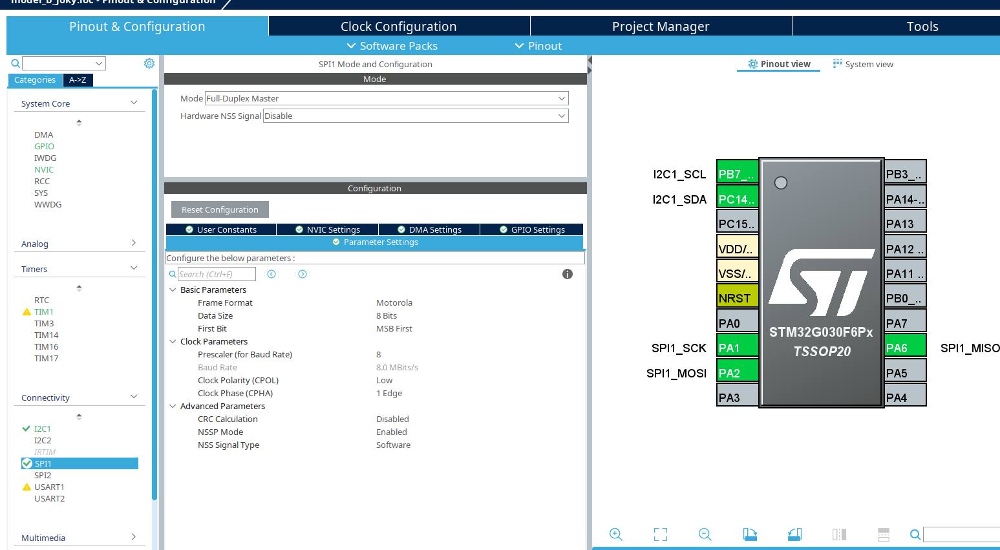

<!-- Title Slide -->

# 📡 Embedded System Design Report

### STM32G030F6P + nRF24L01+ + MAX30102

---

> This report outlines the hardware configuration, software setup, and communication protocol design for a low-cost embedded system that collects biometric data and transmits it wirelessly using a minimal BOM design approach.

## 🔧 Project Components

### 1. STM32G030F6P6
- **Core**: ARM Cortex-M0+ @ 64 MHz
- **Flash**: 32 KB  
- **RAM**: 8 KB  
- **Package**: TSSOP20  
- **Oscillator**: Internal HSI RC oscillator used (no external crystal)
---
### 2. nRF24L01+
- **Wireless transceiver** operating at 2.4 GHz
- Interface: **SPI**
- Application: Wireless data transmission to another node
- 📄 [Datasheet](https://www.nordicsemi.com/-/media/DocLib/Other/Product_Spec/nRF24L01P_PS_v1_0.pdf)
--
### 3. MAX30102
- Integrated **pulse oximetry** and **heart-rate sensor**
- Interface: **I2C**
- 📄 [Datasheet](https://datasheets.maximintegrated.com/en/ds/MAX30102.pdf)

---

## 🔌 Peripheral Configuration

### SPI Interface (for nRF24L01+)
- **Clock speed**: 64 MHz system clock
- **Prescaler**: 8  
- **SPI Speed**: 8 MHz  
- Chosen for high-speed communication while staying within the nRF24L01+ supported SPI limits (~10 MHz max)
---
### I2C Interface (for MAX30102)
- Internal **pull-up resistors** used in software
- **Clock speed**: 100 kHz
- MAX30102 I2C address (default): `0x57`

---

### 🛠️ I2C Pull-Up Problem and Solution

#### 📍 Problem

I2C lines are **open-drain** and require pull-up resistors to define a logical HIGH state. Without them, the lines float, resulting in:

* Signal integrity issues
* Unstable or failed communication
* NACKs or device lockups

#### 🧪 Solutions

| Type     | Description                                                                                |
| -------- | ------------------------------------------------------------------------------------------ |
| Hardware | Use **external pull-up resistors** (2.2kΩ–10kΩ) — standard and recommended for production  |
| Software | Enable **internal STM32 pull-up resistors** via GPIO settings — acceptable for prototyping |
---
✅ **Chosen Approach**:

> Used the **software/internal pull-up resistors** for I2C in this prototype stage.
> Given the **short trace lengths** and **low-speed (100 kHz)** bus, this approach is functionally stable for now.
> However, **external pull-ups are recommended for final PCB** to ensure noise immunity and stronger drive capability.

---

### 🕒 Clock Configuration

* **System Clock Source**: Internal HSI (High-Speed Internal RC oscillator @ 64 MHz)
* **External Crystal**: ❌ **Omitted**

> Decision made to **reduce component count** and simplify PCB layout.
> For this application (SPI at 8 MHz and I2C at 100 kHz), the **internal RC oscillator provides sufficient timing accuracy**.
> If wireless timing drift or USB support is needed later, we can revise and add a crystal.

---

## 📷 Configuration Screenshots

### STM32CubeMX: SPI Configuration (nRF24L01)

---
### STM32CubeMX: I2C with Internal Pull-Up (MAX30102)

---

# 💰 Bill of Materials (BoM)

### Estimated Hardware Cost for 1 Unit

| Component       | Part Number       | Quantity | Unit Price (USD) | Total (USD) |
|----------------|-------------------|----------|------------------|-------------|
| MCU            | STM32G030F6P6     | 1        | $0.60            | $0.60       |
| Wireless Module| nRF24L01+         | 1        | $1.20            | $1.20       |
| Sensor         | MAX30102          | 1        | $2.80            | $2.80       |

**🧾 Total Estimated Cost (Prototype)**: **~$x.xx**

---

## 🔚 Conclusion

This embedded setup is designed for **wireless transmission of heart rate and temperature data** using a cost-effective and low-power solution:

- STM32G030F6P runs at 64 MHz using its **internal HSI** oscillator
- Communicates wirelessly using **nRF24L01+** over SPI @ 8 MHz
- Collects health data via **MAX30102** over I2C with **internal pull-ups**

The design is optimized for:
- Low BOM cost
- Simple PCB layout (no external crystal or I2C resistors)
- Wireless + biometric sensing

---

*Report by: Amer Farg — Embedded Systems Engineer*
